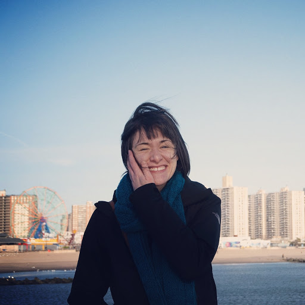

```{r, out.width = '30%', fig.align="center", echo = FALSE}
library(knitr)

```


I am an Assistant Professor in the [Biostatistics Division](https://phs.weill.cornell.edu/research-collaboration/our-divisions/biostatistics) in the [Population Health Sciences Department](https://phs.weill.cornell.edu/about-us) at [Weill Cornell Medicine](https://weill.cornell.edu). My main area of expertise is working on the statistical analysis of structural magnetic resonance imaging (sMRI) data, with a focus on the disease area of Multiple Sclerosis (MS).  The problems I have worked on span many areas, including image segmentation, image normalization and harmonization, cross-sectional and longitudinal modeling, as well as software development.  The statistical techniques used to solve these problems include classification, machine learning, longitudinal data analysis, and functional data analysis techniques.    I did my PhD and ScM in [Biostatsitics at the Johns Hopkins Bloomberg School of Public Health](https://www.jhsph.edu/departments/biostatistics/index.html) under the advisment of [Dr. Ciprian Crainiceanu](http://ciprianstats.org/home) at Johns Hopkins and [Dr. Taki Shinohara](https://www.med.upenn.edu/pennsive/personnel.html) at the University of Pennsylvania. A video describing some of the work in sMRI research from my PhD can be found [here](https://www.youtube.com/watch?v=mzzhd30LiPk&feature=plcp).  Before coming to Weill Cornell, I worked in industry at the healthcare tech companies [Flatiron Health](https://flatiron.com) and [Covera Health](https://www.coverahealth.com) doing electronic medical records (EMR) research. 

I am an avid R enthusiast! I serve on the board of the meetup group [R Ladies NYC](http://www.rladiesnyc.org/). A video of my 2018 R Ladies lightning talk on the reticulate R package can be [here](http://www.rladiesnyc.org/post/lightning-talks-roundup/) (Note: I now know Python so I don't need to use the reticulate package as much!) A video of my 2019 NYR talk on doing neruorimaging analysis in R can be found [here](https://www.youtube.com/watch?v=9HkEq01nrco). 

My full CV is available [here](files/Sweeney_CV.pdf).

