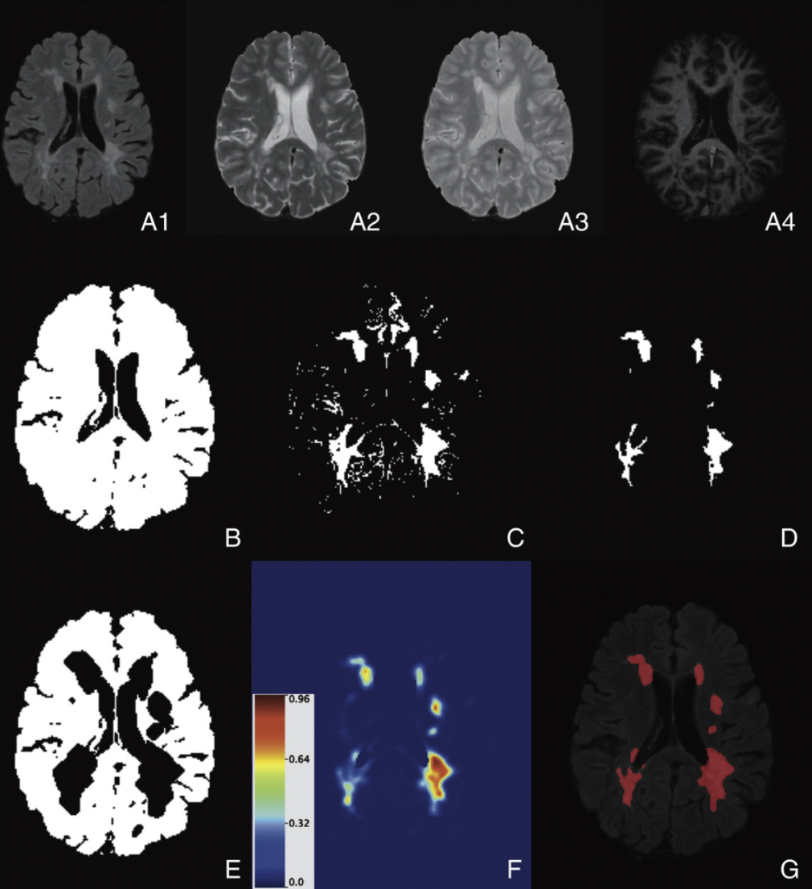

<br> 

#### Longitudinal sMRI in MS Lesions  

Brain structural magnetic resonance imaging (sMRI) is a tool that uses a magnetic field to produce detailed images of the brain. Patients with multiple sclerosis (MS) have lesions in their brains which are visible on sMRI. MS lesions formation is a complex process involving inflammation, tissue damage, and tissue repair — all of which are visible on sMRI and potentially modifiable by pharmacological therapy. We developed a piepline to extract longitudinal information from MS lesions in multisequence sMRI.  We then developed a biomarker of lesion repair and explored the biomarker's association to clinical information, such as the use of steroids and disease-modifying treatment. The picture below shows the longitudinal information extracted from one sequence of structural MRI, the fluid attenuated inversion recovery (FLAIR) image. A publication of this work can be found [here](https://www.sciencedirect.com/science/article/pii/S2213158215300139). 

```{r, out.width = '70%', fig.align="center", echo = FALSE}
library(knitr)
include_graphics("images/longitudinal_mri.png")
```

<br> 

#### MS Lesions Segmentation 

Magnetic resonance imaging (MRI) can be used to detect lesions in the brains of multiple sclerosis (MS) patients and is essential for diagnosing the disease and monitoring its progression. In practice, lesion load is often quantified by either manual or semi-automated segmentation of MRI, which is time-consuming, costly, and associated with large inter- and intra-observer variability.  We developed the method OASIS for automated lesion segmentation at a single time point ([publication](https://www.sciencedirect.com/science/article/pii/S2213158213000235#f0005)) and SuBLIME for segmentation of incident MS lesions ([publication](https://www.sciencedirect.com/science/article/pii/S2213158213000235#f0005)).  We also performed a comparison of different machine learning algorithm for the problem of MS lesion segmentation ([publication](https://journals.plos.org/plosone/article?id=10.1371/journal.pone.0095753)). 


```{r, out.width = '50%', fig.align="center", echo = FALSE}
library(knitr)

```
