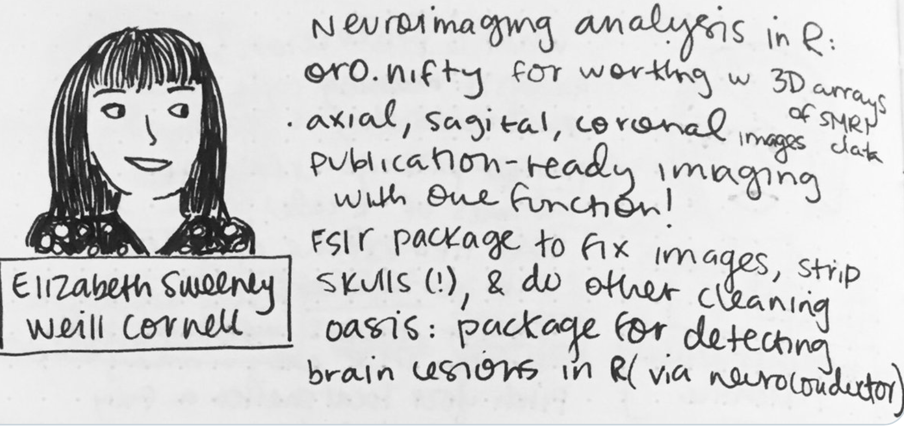

<br> 


```{r, out.width = '60%', fig.align="center", echo = FALSE}
library(knitr)

```
     
|                                               Drawing by [Brooke Watson](https://blog.brooke.science/about/) at the 2019 NYR conference. 

<br> 

#### R Packages 

[oasis](https://cran.r-project.org/web/packages/oasis/index.html) package for segmenting multiple sclerosis lesions on strucutral MRI at a single time point 

[sublime](https://cran.r-project.org/web/packages/sublime/index.html) package for segmenting incident multiple sclerosis lesions on strucutral MRI from two time points